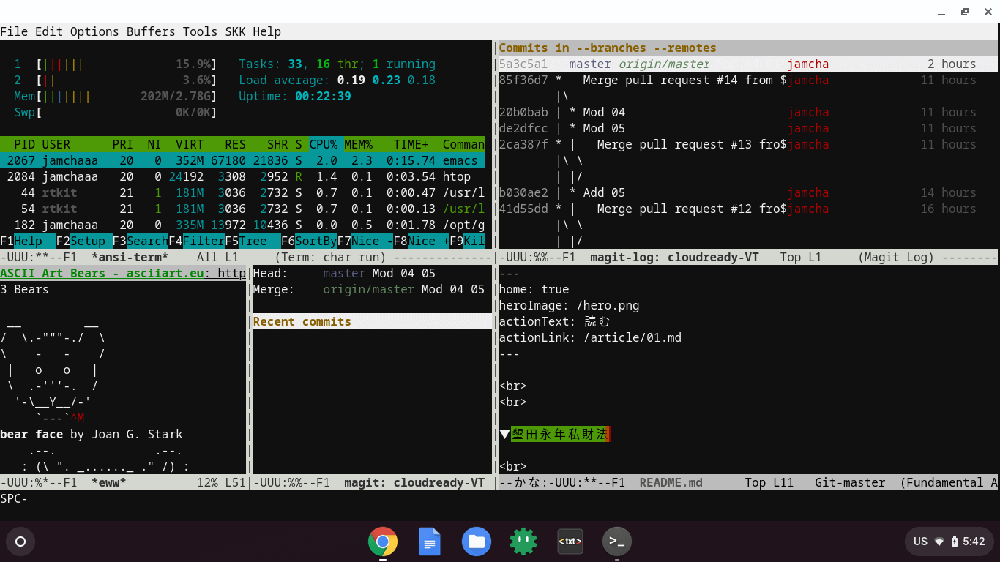

# Compact [Magit](https://magit.vc) environments for Chromebook

Last update: May 4, 2019.

## Install

- Install Crostini first.
- `$ sudo apt install emacs25 cmigemo git`
- Launch `emacs -nw`, then install following packages: `magit` `migemo` `ddskk`

## Usage
- `M-x m-stat` launches magit.
- `C-x C-j` launches SKK, an Japanese Input Method.

## Screenshot

